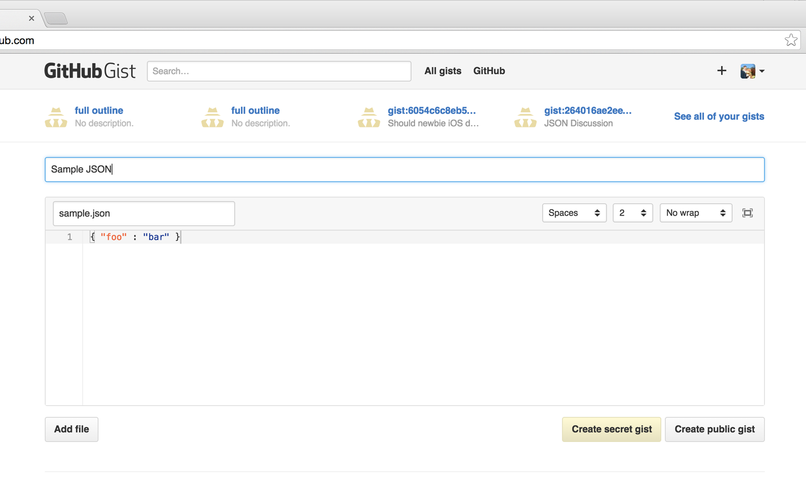
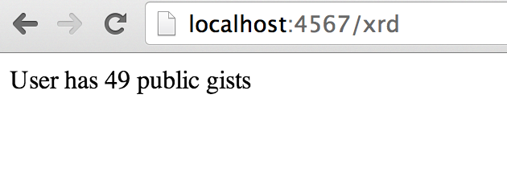
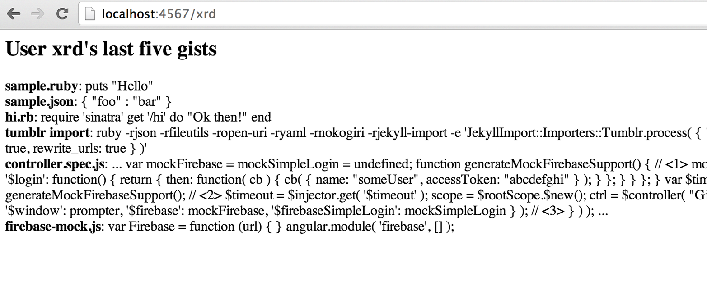

# Gists and the Gist API

gistsid=ix\_chapter-02-gist-asciidoc0range=startofrange
id=ix\_chapter-02-gist-asciidoc0range=startofrange
range=startofrangeGitHub revolutionized software development by
responding to a deep desire to share information. But calling it just
"sharing" does a disservice to the tools GitHub provides: these tools
remove barriers to communication and streamline workflows. These tools
also arose at exactly the moment when the information technology
revolution forced companies to adopt more open technologies that
assisted an emerging remote workforce.

Gists service part of this need: they permit intimate code sharing and
reuse, refactoring, and experimentation in a way not served by the
heavyweight tools predating it. In this chapter we will explore using
gists to share code, and then build an application hosted as a gist that
uses the Gist API.

## Easy Code Sharing

gistscreating creatingGists are straightforward to create. You copy a
snippet of code into the large text box in the center, optionally enter
in a description or filename, and then choose between a public or
private gist. Once your gist has been created you are presented with a
URL to share. Gists autodetect the language in most cases and syntax
highlight according to the language when displayed as in
[figure\_title](#documenting_json_using_a_gist).



There are other services that do this: pastebin was the first, and there
are many others that offer variances on code sharing. But gists by
GitHub are not simply a pasting service. Gists are first-class
repositories, forkable, editable, and expansive. We’ll go over the
basics of what gists are, and how to create them, and then show how they
allow you to share code that is also a live application.

## Gists Are Repositories

gistsas repositories as repositoriesrepositoriesgists as gists asEvery
gist created is a tiny repository. You can update gists and see the
history usinggit log `git log`. You can download gists, hack on the
repository, andgit push `git push` them back into the repository on
*gist.github.com* (which will republish them onto the publicly facing
web page). And, you can "fork" gists, just like any other repository.

You are allowed to branch within gist repositories; however, branches
are not displayed inside of *gist.github.com/*. But if you need the
benefits of branching when using gists you can branch normally inside a
repository and the branch information is retained on the upstream
repository after you push it up.

You can have an unlimited number of public and secret gistssecret gists.
Secret gists can, in many cases, replace private repositories, and these
secret gists don’t count against the limited amount of private
repositories you have with paid GitHub accounts. Or, you can make
apublic gists gist public, and share that URL to mailing lists or
anywhere you need public feedback.

> **Note**
> 
> As there are two types of gists (public and secret), it is important
> to understand the differences between them. Public gists are
> searchable. Secret gists are not searchable, but they are accessible
> to anyone who knows the URL. Don’t post any code to a gist you need to
> keep secret as once you put it there, it is only as safe as the URL is
> secret.

Most people share gists through the URL, but you can embed gists inside
of other contexts (like blogs) and get a simple and pretty snippet of
code.

### Embedding Gists Inside HTML

gistsin HTML in HTMLHTMLgists in gists inTo embed inside of an HTML page
look for the "Embed this gist" box to the left of a gist. Copy the code
listed there (which will look something like `<script
src="https://gist.github.com/xrd/8923697.js"></script>`) and paste it
into your HTML.

If you wish to include only a particular file from the gist (if it
contains multiple files), then add `?file=hi.rb` to the end of the URL
specified in the src attribute.

### Embedding Inside Jekyll Blogs

gistsin Jekyll blogs in Jekyll blogsJekyll blogsgists in gists inJekyll
blogs (explained in [???](#Jekyll)) can easily host gists using a
special syntax. The shortcut `` will embed a private
gist, which would be found at *<http://gist.github.com/8138797>*. If you
want to use a specific file within the gist, add a filename to the gist
code like ``. Secret gists can also be embedded.
If you use a secret gist, prefix the username of the account holder in
the gist like so: ``.

Now let’s look at creating gists from outside the GitHub.com site, using
the command-line.

## Gist from the Command Line

command linegists from gists fromgistsfrom command line from command
line`gem install gist` gem install gist commandwill install a command
line tool that helps create gists. You can use it simply by typing the
command, and then entering the data you want to post as a gist:

``` bash
$ gist
(type a gist. <ctrl-c> to cancel, <ctrl-d> when done)
{ "foo" : "bar" }
https://gist.github.com/9106765
```

The gist command will return the link to the gist just created. Gists
are created anonymously by default. You can log in using the `--login`
switch. Once you do this, your gists will be linked to your account:

``` bash
$ gist --login
Obtaining OAuth2 access_token from github.
GitHub username: xrd
GitHub password:
2-factor auth code: 787878

Success! https://github.com/settings/applications
```

You can pipe text to the gist command to use the contents of that file:

``` bash
$ echo '{ "foo" : "bar" }' | gist
https://gist.github.com/9106799
```

You can also `cat` a file to gist:

``` bash
$ cat MyJavaFile.java | gist
https://gist.github.com/9345609
```

Gists are often used to show interesting or troublesome code, and there
are times when you don’t want to display the entirety of a file. In this
case the command-linegrep tool `grep` tool can be useful; `grep`
searches for a specific piece of code and with the right switches can
include several lines of context around that code inside a gist. This
command looks for the function `myFunction` inside the *MyJavaFile.java*
file and then prints the next 20 lines of context and stores it as a
gist:

``` bash
$ grep -A 20 myFunction MyJavaFile.java | gist
https://gist.github.com/9453069
```

Adding –o switchthe `-o` switch automatically opens the gist inside your
default web browser. You can also copy the gist URL to the clipboard
using –c switchthe `-c` switch. Or, you can copy the contents of your
clipboard into a gist using–P switch the `-P` switch.

There are many other fun features of the gist command. To learn more run
the gist command with––help switch the `--help` switch.

As gists are themselves repositories, you can use them for dual
purposes: for hosting code samples, and for code samples that are
themselves fully working and packaged applications inside a gist
repository.

## Gists as Fully Functioning Apps

gistsas fully functioning apps as fully functioning appsLet’s build a
simple Sinatra application to showcase how code hosted as a gist can
also be a living application. SinatraSinatra is a Ruby library for
creating dead-simple web servers. A Sinatra program can be as simple as
this:

``` ruby
require 'sinatra'

get '/hi' do
  "Hello World!"
end
```

Create a gist for this by visiting gist.github.com. Enter in the text
exactly as shown and then choose public gist.

You now have a share-friendly gist of code anyone can use to review.
More importantly, this is a repository with executable code. To clone
it, look for the Clone URL to the right of the gist itself. You will
likely see a Git protocol URL and an HTTPS URL. If you are cloning the
URL and intend only to read the gist, you can use the HTTPS URL. You
technically can push changes once you have cloned a repository using the
HTTPS URL but not if you have two-factor authentication enabled. In most
cases it is easier and more flexible to use the Git protocol URL.

Let’s clone it now:

``` bash
$ git clone git@gist.github.com:8138797.git
```

Once you have cloned the repository, go inside it. You’ll see a list of
files, a list that right now includes only one file:

``` bash
$ cd 8138797
$ ls
hi.rb
```

This code is exectuable: to run it enter `ruby hi.rb`.

If you have not used Sinatra with Ruby before, this will cause an error.
This program requires a library called "sinatra" and you have not yet
installed it. We could write a read me file, or add documentation into
this file itself. Another way to guarantee the user has the proper files
installed is toGemfile use a *Gemfile*, which is a file that tells which
libraries are installed and from where. That sounds like the best way:

``` bash
$ printf "source 'https://rubygems.org'\ngem 'sinatra'" > Gemfile
```

The `bundle` command (from the bundler gem) will install Sinatra and the
associated dependencies:

``` bash
$ bundle
Using rack (1.5.2)
Using rack-protection (1.5.1)
Using tilt (1.4.1)
Using sinatra (1.4.4)
Using bundler (1.3.5)
Your bundle is complete!
Use `bundle show [gemname]` to see where a bundled gem is installed.
```

Why did we do things this way? Because now we can add the Gemfile to our
repository locally, and then publish into our gist for sharing on the
Web. Our repository now not only has the code, but a well-known manifest
file that explains the necessary components when running the code.

## Gists that Render Gists

gistsfor rendering other gistsid=ix\_chapter-02-gist-asciidoc1
id=ix\_chapter-02-gist-asciidoc1range=startofrange
range=startofrangeLet’s add to our application and use
theOctokitOctokit Ruby Octokit Ruby gem to pull all public gists for any
user we specify. The Octokit library is the the official Ruby library
for accessing the GitHub API. Why would we want to make a gist that
displays other gists? Self-referential meta code is all the rage, the
modern-day response to René Magritte’s famous work: "Ceci n’est pas une
pipe."\[1\]

Add a view *index.erb* at the root of our directory:

``` ruby
<html>
<body>

User has <%= count %> public gists

</body>
</html>
```

Add the Octokit gem to our Gemfile:

``` ruby
gem "octokit"
```

Run `bundle` to install Octokit. Then, modify our *hi.rb* app to look
like this:

``` ruby
require 'sinatra'
require 'octokit'

set :views, "."

get '/:username' do |username|
  user = Octokit.user username
  count = user.public_gists
  erb :index, locals: { :count => count }
end
```

Our filesystem should look like this, with three files:

``` bash
$ ls -1
Gemfile
hi.rb
index.erb
```

Restart Sinatra by running Ctrl-C and then `ruby hi.rb`. If you visit
*<http://localhost:4567/xrd>* in your browser, you will see the count of
public gists for user `xrd`
([figure\_title](#displaying_the_gist_count)); modify the username in
the URL to specify any GitHub username and you will see their last five
gists displayed.



### Going Deeper into the Gist API

gistsand hypermedia and hypermediaHypermedia APIgist and gist andThe
GitHub API uses hypermedia instead of basic resource-driven APIs. If you
use a client like Octokit, the hypermedia details are hidden behind an
elegant Ruby client. But there is a benefit to understanding how
hypermedia works when you need to retrieve deeper information from the
GitHub API.

gistsand RESTful APIs and RESTful APIsRESTful APIsMost RESTful APIs come
withsitemaps a "sitemap," generally an API reference document that tells
a user which endpoints to use. You view the resources available from
that API and then apply some HTTP verb to do something to them.
Hypermedia thinks of an API differently. Hypermedia APIs describe
themselves inside their responses affordancesusing "affordances." What
this means is that the API might respond like this:

``` json
{
    "_links": {
        "self": {
            "href": "http://shop.oreilly.com/product/0636920030300.do"
        }
    }
    "id": "xrd",
    "name": "Chris Dawson"
}
```

In this payload, you can see that there is an id ("xrd") and a name
("Chris Dawson"). This particular payload was forked from the HAL
explanation at the [HAL Primer document](http://bit.ly/1SGLDw3), and you
can find a more detailed explanation of these concepts there.

The important thing to note about hypermedia APIs is that payloads
contain metadata about data itself and metadata about the possible
options of operating on the data. RESTful APIs typically provide a
mapping outside of the payload. You have to join the API sitemap with
the data in an ad hoc way when using RESTful APIs; with hypermedia APIs
your client can react to the payload itself correctly and intelligently
without knowing anything about a sitemap stored in human-readable
documentation.

This loose coupling makes APIs and their clients flexible. In theory, a
hypermedia API works intuitively with a hypermedia-aware client. If you
change the API, the client, as it understands hypermedia, can react and
still work as expected. Using a RESTful API means that clients must be
updated (a newer version of the client must be installed) or the client
code must be upgraded. Hypermedia APIs can alter their backend, and then
the client, as long as it is hypermedia-aware, can automatically and
dynamically determine the right way to access information from the
response itself. In other words, with a hypermedia client the API
backend can change and your client code should not need to.

This is explained in great detail in the book Building Hypermedia APIs
with HTML5 and Node (O'Reilly).

### Using Hypermedia Data from Octokit

gistsusing hypermedia data from Octokit using hypermedia data from
Octokithypermedia data, OctokitOctokitusing hypermedia data from using
hypermedia data fromNow that you know a little about hypermedia, let’s
navigate it using Octokit:

  - Start at a resource, with code like `user = Octokit.user "xrd"`.
    This begins the initialization of the client.

  - `user` now is an object filled with the actual data of the resource.
    In this case, you could call a method like `user.followers` to see a
    meager follower count.

  - `user` also has hypermedia references. You can see these by calling
    `user.rels`. This retrieves the relationships described in the
    hypermedia links.

  - Relationships (found by calling `user.rels`) include avatar, self,
    followers, etc.

  - Use a relationship by calling the `get.data` method to retrieve and
    access the data from the GitHub API (`followers =
    user.rels[:followers].get.data`).

  - Calling `.get.data` populates an array of the followers (paged if it
    exceeds 100 items).

Let’s extend our Sinatra app to retrieve actual data about the user’s
gists by using hypermedia references:

``` ruby
require 'sinatra'
require 'octokit'

set :views, "."

helpers do
  def h(text)
    Rack::Utils.escape_html(text)
  end
end

get '/:username' do |username|
  gists = Octokit.gists username, :per_page => 5
  erb :index, locals: { :gists => gists, username: username }
end
```

The *index.erb* file contains code to iterate over each gist and pull
the content. You can see that our response object is an array of gists,
and each has an attribute called `fields`. This `fields` attribute
specifies the filenames available in each gist. If you reference that
filename against the files, the response includes a hypermedia `ref`
attribute. Retrieve the `raw` content using the Octokit method
`.get.data`:

``` html
<html>
<body>

<h2>User <%= username %>'s last five gists</h2>

<% gists.each do |g| %>
<% g[:files].fields.each do |f| %>
<b><%= f %></b>:

<%= h g[:files][f.to_sym].rels[:raw].get.data %>

<br/>
<br/>

<% end %>
<% end %>

</body>
</html>
```

Now we see the gists and the contents, as in
[figure\_title](#last_five_gists_with_details).range=endofrangestartref=ix\_chapter-02-gist-asciidoc1
startref=ix\_chapter-02-gist-asciidoc1



## Summary

In this chapter we looked at gists and learned how they can be used to
share code snippets. We built a simple application and stored it as a
gist. This application retrieves data from the GitHub API using our
first higher-level language client library (the Octokit library for
Ruby). We also went deeper into how hypermedia works and how a client
library implements using hypermedia
metadata.range=endofrangestartref=ix\_chapter-02-gist-asciidoc0
startref=ix\_chapter-02-gist-asciidoc0

In the next chapter we will look at Gollum, the GitHub wiki. This
chapter provides an introduction to the Rugged Ruby library for
accessing Git repositories and the Ruby library for accessing GitHub.

1.  [Explained best by Ben Zimmer](http://bit.ly/1Ot2qOd)
