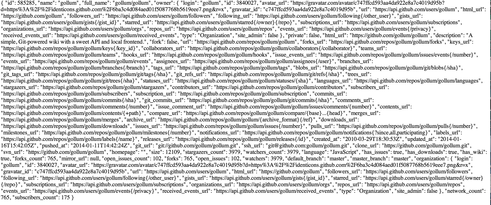
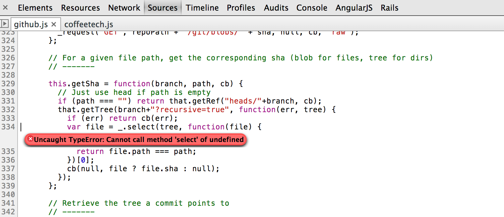
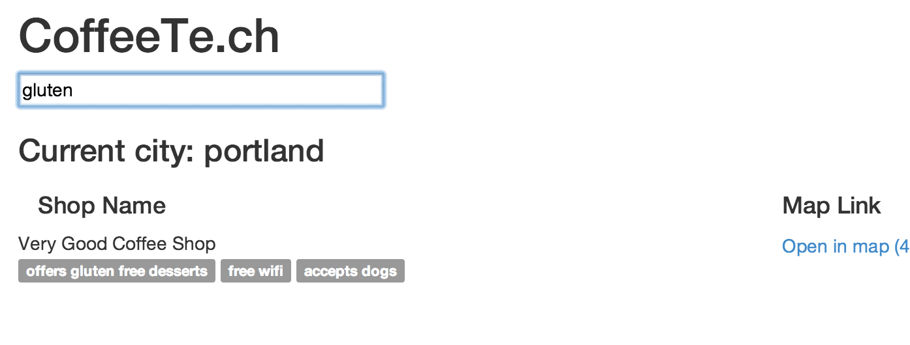
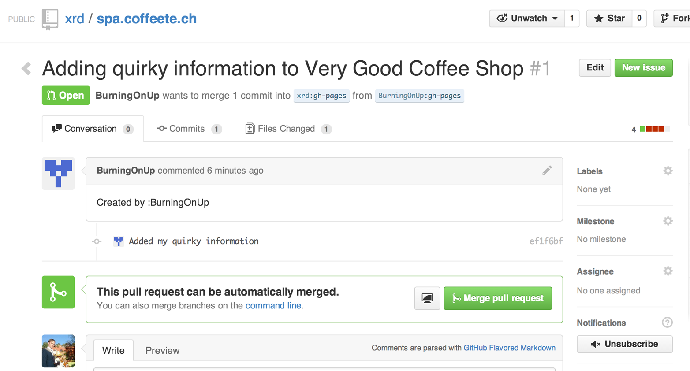
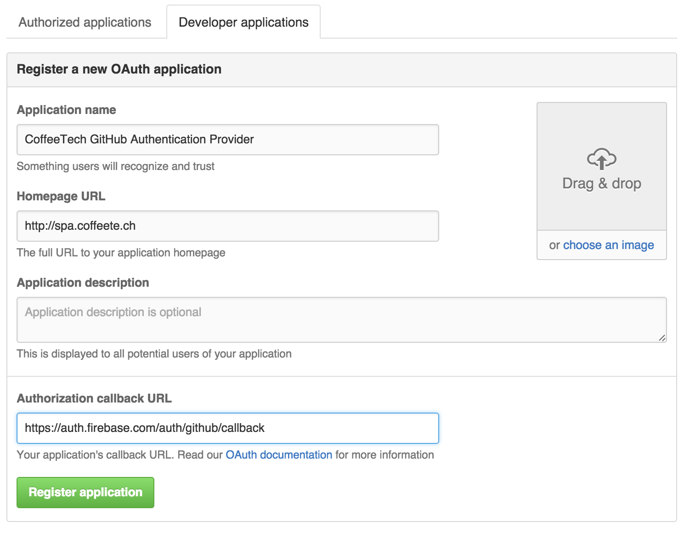
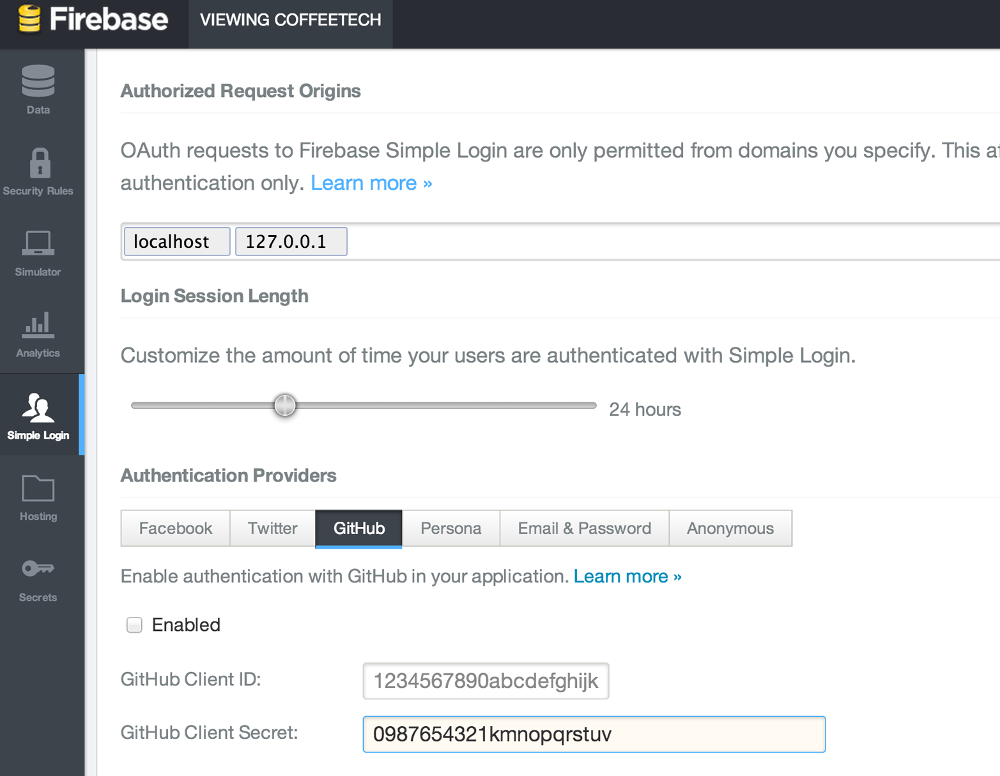

# JavaScript and the Git Data API

JavaScriptid=ix\_chapter-04-javascript-asciidoc0range=startofrange
id=ix\_chapter-04-javascript-asciidoc0range=startofrange
range=startofrangeApplications utilizing the GitHub API will typically
reside inside a server. You are not limited, however, to accessing the
API from within server-side programming languages exclusively. The
GitHub API works perfectly well from within a web browser context as
well, and the UI to your application comes for free if you know a little
HTML. In this chapter we discuss how to use the unofficial JavaScript
client library to access the GitHub API and build a single-page
application (SPA), which we host entirely on GitHub.

The main weakness of JavaScript has always been testability. Mainly due
to the asynchronous nature of JavaScript, writing tests has never been
easy; polling for changes when a callback returns was until recently the
best way to test nonlinear code. But recent toolkits like AngularJS and
promise-based libraries have made testing not only easy, but elegant as
well. Building applications on top of third-party services makes testing
even more important than it already was, and we’ll make sure to add
testing to our application to verify the functionality works as we
expect.

JavaScript should be generally accessible to most people who know other
imperative programming languages. callbackThere is one feature, however,
that can be challenging: the callback function. In JavaScript, functions
are first-class objects, meaning they can be passed as arguments to
other functions and stored as the value of a variable. You will find
callbacks everywhere in JavaScript programming. Callbacks make debugging
and understanding JavaScript code more challenging at times. As we
stated earlier, writing code that includes tests makes understanding the
entire picture easier, and we will do that in this chapter to further
explain sections where necessary function callbacks may initially look
confusing.

## Building a Coffee Shop Database on GitHub

coffee shop database
appid=ix\_chapter-04-javascript-asciidoc1range=startofrange
id=ix\_chapter-04-javascript-asciidoc1range=startofrange
range=startofrangeLike many software developers, I suffer from an almost
disturbing obsession with coffee. Perhaps it is really my family that
suffers: when we travel to a new city, I drag my wife and children
through questionable neighborhoods just to find the perfect brew and
complementary gluten-free desserts.

Google MapsGoogle Maps is a great help on these quests, in that it will
find me a coffee shop and reviews, but the granularity of information
about that coffee shop is often poor and limited in scope. Do they offer
rice milk as a dairy-free alternative? What special details should I
know when considering a place? Many guidance and mapping applications
exist, but if they don’t fit my own personalized informational niche, I
might miss a unique experience. With such a pressing and dire problem in
front of us, let’s use the GitHub API to solve it.

We’ll build a coffee shop single-page web app that allows anyone to add
information on coffee shops, information that is flexible and dynamic,
and search and filter through that information about a coffee shop. All
files, such as the HTML, images, and JavaScript will be hosted on
GitHub. And we’ll be using the GitHub API to allow contributors to add
data to our database, a database we will also host on GitHub. And as
GitHub developers write code with tests, we will write tests to validate
our JavaScript code as well as the expectations we have of the GitHub
API.

More specifically, we’ll use these technologies:

  - [An (unofficial) GitHub API JavaScript
    library](https://github.com/michael/github)

  - [AngularJS](http://angularjs.org), a "superpowered framework" for
    writing JS applications that are testable

  - [Bootstrap](http://getbootstrap.com), a CSS library that simplifies
    building beautiful webapps

You don’t need to know these technologies in advance of working on this
chapter.

## Set Up

coffee shop database appsetupid=ix\_chapter-04-javascript-asciidoc2
id=ix\_chapter-04-javascript-asciidoc2range=startofrange
range=startofrangeTo create our app, let’s first create our main web
page and push it into our repository:

``` bash
$ mkdir coffeete.ch
$ cd coffeete.ch
$ git init
$ git checkout -b gh-pages
$ printf "<html>\n<body>Hello from CoffeeTe.ch</body>\n</html>\n" > index.html
$ git commit -m "Add starting point index.html" -a
$ git config push.default gh-pages
```

Notice that we created a new repository, and then created and entered
the gh-pages branch. We’ll do all our work there. And by using the git
config command, we specified that we want the default push branch to be
gh-pages. This allows us to use `git push` to push our branch up instead
of the longer `git push origin gh-pages`.

### Mapping Hostnames

coffee shop database appmapping hostnames mapping hostnameshostnames,
mappingOnce we publish these files into GitHub inside a repository we
can connect the repository to a real hostname. There are two steps to
take to do this:

  - Add a CNAME file that tells GitHub under which server name this
    service should resolve.

  - Set up DNS records so that the hostname maps to the correct IP
    address at GitHub.

Imagine you have the hostname *myspecialhostname.com*. If you map this
repository to a subdomain called *coffeetech*, then you would do
something like this:

``` bash
$ echo 'coffeetech.myspecialhostname.com' > CNAME
$ git commit -m "Added CNAME mapping" -a
$ git push
```

Remember that you need to wait about 10 minutes before GitHub
regenerates its database to establish the connection between your
gh-pages site and the mapping on their frontend servers. This is only
the first time you connect a repository to a hostname; you will see
subsequent changes almost instantaneously.

> **Note**
> 
> Generally it takes several hours to even a few days to propagate DNS
> settings out into the wild, so make sure you choose and set up a
> hostname far in advance if your site has to be live by a certain
> point.

Now we can install the libraries needed for this application.

### Adding the Support Libraries

AngularJSBootstrapcoffee shop database appsupport libraries for support
libraries forGitHub.js libraryAs we mentioned, we will use the GitHub.js
library, AngularJS, and Bootstrap. Let’s add those to our project now.
Using whatever editor you prefer, edit the *index.html* file to look
like this:

``` html
<html>
<head>
<title>CoffeeTe.ch</title>
<meta name="viewport" content="width=device-width, initial-scale=1.0"> 
<link rel="stylesheet" type="text/css" href="bootstrap.min.css"></link>
</head>
<body ng-app> 
<div class="container">
{{'Welcome to Coffeete.ch'}} 
</div>
<script src="angular.js"></script>
<script src="github.js"></script>
</body>
</html>
```

I am assuming you have a firm grasp on most HTML concepts, but a few of
the advanced topics are included here:

  - The `meta` tag makes our page work well with mobile browsers and
    enables the responsive features of Bootstrap.

  - The `ng-app` attribute in the body tag tells AngularJS to initialize
    and compile our page from the body tag downward.

  - The `{{ }}` (double brackets) are an AngularJS two-way data binding
    directive. You’ll see two-way data binding in action very soon if it
    is not already familiar. Adding this code here sanity checks whether
    AngularJS is working for us; if we see "Welcome to Coffeete.ch"
    without the braces then we know AngularJS is loading and working
    properly. If we see the braces, then there is some error in our
    setup to resolve. Two-way data binding solves a significant pain
    point when building JS apps: marshalling data back and forth between
    network events, into HTML and out of HTML forms. AngularJS does all
    this heavy lifting for you. In a moment we’ll show how to use
    two-way data binding as it was intended by defining a variable on
    the AngularJS scope. We then access the variable using the same `{{
    }}` data binding directives.

Then, download the necessary files locally using these commands. We
include AngularJS, GitHub.js, and Bootstrap CSS:

``` bash
$ wget https://ajax.googleapis.com/ajax/libs/angularjs/1.2.10/angular.js
$ wget https://maxcdn.bootstrapcdn.com/bootstrap/3.3.5/css/bootstrap.min.css
$ wget https://github.com/michael/github/raw/master/github.js
```

Now we are ready to use the GitHub library inside our
SPA.range=endofrangestartref=ix\_chapter-04-javascript-asciidoc2
startref=ix\_chapter-04-javascript-asciidoc2

## An AngularJS Application Using GitHub.js

AngularJSapplication using
GitHub.jsid=ix\_chapter-04-javascript-asciidoc3
id=ix\_chapter-04-javascript-asciidoc3range=startofrange
range=startofrangecoffee shop database appAngularJS application using
GitHub.jsid=ix\_chapter-04-javascript-asciidoc4
id=ix\_chapter-04-javascript-asciidoc4range=startofrange
range=startofrangeGitHub.js
libraryid=ix\_chapter-04-javascript-asciidoc5range=startofrange
id=ix\_chapter-04-javascript-asciidoc5range=startofrange
range=startofrangeNow let’s implement a *coffeetech.js* file, which is
where we will build our single-page application functionality. Create a
new file called *coffeetech.js* in the root of your repository:

``` javascript
var mod = angular.module( 'coffeetech', [] ) 
mod.controller( 'GithubCtrl', function( $scope ) { 
  var github = new Github({} ); 
  var repo = github.getRepo( "gollum", "gollum" ); 
  repo.show( function(err, repo) { 
    $scope.repo = repo;
    $scope.$apply(); 
  });
})
```

  - Define a module named "coffeetech." Save a reference to the module
    we will use next in defining a controller, a smaller bundle of
    functions. Modules are an AngularJS feature for grouping related
    functionality, and we will keep all our code for this application
    inside this module.

  - We define a controller called `GithubCtrl` that bundles up functions
    and data. When we use the controller syntax, we name the controller,
    and then define a function with at least a single parameter: the
    scope object. I think of scope as the "world" available to the
    controller. The controller knows only of data and functions defined
    on its scope, and AngularJS does its magic as long as your functions
    or variables are defined on the scope.

  - We create a new `Github()` object using the constructor. This
    constructor can take user credentials, but for now, we can just
    create it without those since we are accessing a public repository.

  - Once we have our `github` object, we call the method `getRepo()`
    with an owner and a name. This returns our repository object.

  - To actually load the data for this repository object, we call the
    `show` method and pass it a callback that uses the two parameters
    `err` and `repo` to handle errors or otherwise provide us with
    details of the repository specified. In this case we are using the
    Gollum wiki public repository to display some sample data.

  - Once we have loaded the repository data, we need to call `$apply` to
    tell AngularJS a change has occurred to data stored within the scope
    variable. As we mentioned before, AngularJS knows only about
    functions and data defined on its scope. The `show` function is
    defined on the GitHub object, and any changes are not tracked by
    AngularJS, so we need to use `$apply()`.

GitHub.js handles making the proper request to GitHub for us, and
AngularJS handles putting the results into our web page. To modify our
HTML to use this data, we change *index.html* to look like the
following:

``` html
<html>
<head>
<title>CoffeeTe.ch</title>
<meta name="viewport" content="width=device-width, initial-scale=1.0">
<link rel="stylesheet" type="text/css" href="bootstrap.min.css"></link>
</head>
<body ng-app="coffeetech"> 
<div class="container" ng-controller="GithubCtrl">
{{ repo }} 
</div>
<script src="angular.js"></script>
<script src="github.js"></script>
<script src="coffeetech.js"></script> 
</body>
</html>
```

  - Change the `ng-app` reference to use the module we defined in our
    *coffeetech.js* file.

  - Remove our data binding to the `Welcome to CoffeeTech` string and
    replace it with a binding to the variable `repo` (by default
    AngularJS will filter complex objects and convert them to JSON).

  - Add a reference to our *coffeetech.js* file beneath our other JS
    references.

If you load this up in your browser, you will see something like
[figure\_title](#the_whole_messy_json).



That is a lot of data. AngularJS’s JSON filter pretty-printed it for us,
but this is a bit too much. Let’s change the HTML to reduce some noise:

``` html
<html>
<head>
<title>CoffeeTe.ch</title>
<meta name="viewport" content="width=device-width, initial-scale=1.0">
<link rel="stylesheet" type="text/css" href="bootstrap.min.css"></link>
</head>
<body ng-app="coffeetech">
<div class="container" ng-controller="GithubCtrl">
<div>Subscriber count: {{ repo.subscribers_count }}</div>
<div>Network count: {{ repo.network_count }}</div>
</div>
<script
src="angular.js"></script>
<script src="github.js"></script>
<script src="coffeetech.js"></script>
</body>
</html>
```

We can filter this information by modifying the HTML to show just a few
vital pieces of information from the repository JSON. Let’s display the
`subscriber_count` and the `network_count`. Now we see something more
palatable ([figure\_title](#pulling_out_what_we_want)).


We’ve just extracted the subscriber and network count from the Gollum
repository hosted on GitHub using the GitHub API and placed it into our
single-page app.

### Visualize Application Data Structure

coffee shop database appapplication database structure visualization
application database structure visualizationWe are going to be building
a coffee shop database. We want to use Git as our datastore, but Git and
its associated tools (either command-line tools or GitHub) don’t offer
the same features as a standard relational database. So, we need to
think and plan how we will structure our data inside our repository to
make it easily searchable.

This application allows us to search coffee shops. These coffee shops
will be, for the most part, in larger cities. If we keep all the data
stored as JSON files named after the city, we can keep data located in a
file named after the city, and then either use geolocation on the client
side to retrieve a set of the data, or ask the user to choose their city
manually.

If we look at the [GitHub.js JavaScript documentation on
GitHub](https://github.com/michael/github) we can see that there are
some options for us to pull content from a repository. We’ll store a
data file in JSON named after the city inside our repository and
retrieve this from that repository. It looks like the calls we need to
use are `github.getRepo( username, reponame )`, and once we have
retrieved the repository, `repo.contents( branch, path, callback )`.

Now that we have a barebones application let’s pause and make sure we
are building something we can refactor and maintain long term. This
means adding tests to our project.

### Making Our App Testable

coffee shop database apptestability of app testability of
apptestingcoffee shop database app coffee shop database appTesting not
only builds better code by making us think clearly about how our code
will be used from the outside, but makes it easier for an outsider
(meaning other team members) to use our code. Testing facilitates
"social coding."

We’ll use a JavaScript testing tool calledKarma "Karma." Karma
simplifies writing JavaScript unit tests. We need to first install the
tool, then write a test or two. Karma can easily be installed using npm
(installation of which is documented in [???](#appendix)):

``` bash
$ npm install karma -g
$ wget https://ajax.googleapis.com/ajax/libs/angularjs/1.2.7/angular-mocks.js
```

The *angular-mocks.js* file makes it easy to mock out Angular
dependencies in our tests.

Then, create a file called *karma.config.js* and enter the following
contents:

``` javascript
module.exports = function(config) {
  config.set({
    basePath: '',
    frameworks: ['jasmine'],
    files: [ 
        'angular.js',
        'fixtures-*.js',
        'angular-mocks.js',
        'firebase-mock.js',
        'github.js',
        '*.js'
    ],
    reporters: ['progress'],
    port: 9876,
    colors: true,
    logLevel: config.LOG_INFO,
    autoWatch: true,
    browsers: ['Chrome'], 
    captureTimeout: 60000,
    singleRun: false
  });
};
```

This is more or less a default Karma configuration file.

  - The `files` section specifying the load order of our JavaScript
    implementations and the test scripts. You can see a few of the files
    we’ve added specified directly and wildcards to cover the remaining
    files.

  - Note also that we’ve specified Chrome as our test browser (so you
    should have it installed), which is a safe bet because it works on
    just about any desktop platform you might be running. Know that you
    can always choose Safari or Firefox if you want Karma to test inside
    those as well. Karma will start a new instance of each browser
    specified and run your tests inside a test harness in those
    browsers.

To write the test, let’s clarify what we want our code to do:

  - When a user first visits the application, we should use the
    geolocation features of their browser to determine their location.

  - Pull a file from our repository that contains general latitude and
    longitude locations of different cities.

  - Iterate over the list of cities and see if we are within 25 miles of
    any of the cities. If so, set the current city to the first match.

  - If we found a city, load the JSON data file from GitHub.

Concretely, let’s assert that we load the list of cities and have two of
them, then we load a matching city named "Portland," a city that has
three shops available.

We’ll use an `ng-init` directive, which is the mechanism to tell
AngularJS we want to call the function specified when the controller has
finished loading. We’ll call this function `init` so let’s test it.

AngularJSJasmine test framework for Jasmine test framework
forJasminetest framework for coffee shop database app test framework for
coffee shop database appFirst, we will write the setup code for an
AngularJS test written using the Jasmine test framework. Jasmine is a
"behavior-driven JavaScript" library that provides functions to group
and create expectation-based tests. Within the Jasmine framework are
"matchers" that allow for the most common assertions (comparing a
variety of expected types to the resultant types from function calls)
and the ability to define your own custom matchers. Jasmine also gives
you the ability to "spy" on functions, which is another way of saying
Jasmine can intercept function calls to validate that those calls were
made in the way you anticipate. It is easiest to explain the power of
Jasmine by showing the elegance of the tests themselves, so let’s do
that now:

``` javascript
describe( "GithubCtrl", function() {
    var scope = undefined; 
    var ctrl = undefined;
    var gh  = undefined;
    var repo = undefined;
    var geo = undefined;

    beforeEach( module( "coffeetech" ) ); 

    beforeEach( inject( function ($controller, $rootScope ) { 
            generateMockGeolocationSupport(); 
            generateMockRepositorySupport();
            scope = $rootScope.$new(); 
            ctrl = $controller( "GithubCtrl",
         { $scope: scope, Github: gh, Geo: geo } ); 
        } )
    );
...
```

  - We declare our variables at the top of the function. If we did not
    do this, JavaScript would silently define them inside the functions
    the first time the variable is used. Then our variables would be
    different inside our setup code and the actual tests.

  - We load our `coffeetech` module into our tests using the `module`
    method inside a `beforeEach` call, code that is executed before our
    tests run.

  - `inject` is the AngularJS way to provide our before functions with
    the `$controller` and `$rootScope` objects, which we use to set up
    our tests.

  - We will be creating two functions that generate the mock objects
    required for our tests. We’ll discuss these two functions in a bit.

  - scope is the AngularJS convention for the object into which all
    functionality and state is stored. We create a new scope using the
    AngularJS utility function `$rootScope.$new()` and store a reference
    to this scope so we can test functionality we’ve implemented in our
    actual code.

  - We pass in the mocked objects (created by the mocked function calls)
    as well as the scope object and instantiate a controller object.
    This controller uses the scope to define functions and data, and
    since we have a reference to it, we can call those functions and
    inspect that data and assert our implementation is correct.

Now, let’s write an actual test:

``` javascript
    describe( "#init", function() { 
        it( "should initialize, grabbing current city", function() { 
            scope.init(); 
            expect( geo.getCurrentPosition ).toHaveBeenCalled(); 
            expect( gh.getRepo ).toHaveBeenCalled();
            expect( repo.read ).toHaveBeenCalled();
            expect( scope.cities.length ).toEqual( 2 ); 
            expect( scope.city.name ).toEqual( "portland" );
            expect( scope.shops.length ).toEqual( 3 );
        });
    });
});
```

  - Describe functions are used to group tests defined inside `it`
    functions. Since we are testing the `init` function, it seems
    logical to use an identifier called `#init`.

  - `describe` blocks group tests while `it` blocks actually specify
    code that is run as a test.

  - Our controller code begins with an `init` call, so we mimic that
    inside our test to set up the controller state.

  - We assert that our code uses the various interfaces we defined on
    our injected objects: `getCurrentPosition` on the geo object, and
    `read` on the repository object.

  - Then we assert that the data is properly loaded. Our test verifies
    that there are two cities, that a default city has been loaded and
    the name of the default city is equal to the string "portland". In
    addition, the test verifies there are three shops loaded for the
    default city. Behind the scenes in our implementation we will load
    these via JSON, but all we care about is that the interface and data
    matches our expectations.

This syntax initially can look confusing if you have never written
Jasmine tests for JavaScript, but it actually solves a lot of problems
in an elegant way. Most importantly, Jasmine provides aspyOn function
`spyOn` function that will intercept a call to it, and then allow you to
assert that it was called. Any place in our tests you see
`toHaveBeenCalled()` is an assertion that `spyOn` provides to us proving
that a call was made.

Now we can implement the two mocking functions vital for the test. Put
them in between the `beforeEach( module( "coffeetech" ) )` line and the
`beforeEach( inject( ... ) )` functions to provide proper visibility to
Karma:

``` javascript
...
beforeEach( module( "coffeetech" ) );

function generateMockGeolocationSupport( lat, lng ) { 
    response = ( lat && lng ) ?
        { coords: { lat: lat, lng: lng } } :
  { coords: CITIES[0] };
    geo = { getCurrentPosition: function( success, failure ) { 
        success( response );
    } };
    spyOn( geo, "getCurrentPosition" ).andCallThrough(); 
}

function generateMockRepositorySupport() { 
    repo = { read: function( branch, filename, cb ) { 
        cb( undefined,
      JSON.stringify( filename == "cities.json" ?
              CITIES : PORTLAND ) );
    } };
    spyOn( repo, "read" ).andCallThrough();

    gh = new Github({});
    spyOn( gh, "getRepo" ).andCallFake( function() { 
        return repo;
    } );
}

beforeEach( inject( function ($controller, $rootScope ) {
...
```

  - We first implement the `generateMockLocation` function.

  - Mock location involves creating a geo object that has a single
    function `getCurrentPosition`, which is a function that calls back
    into a success callback function provided. This exactly matches the
    native browser support for Geolocation, which has the same function
    defined.

  - We then `spyOn` the function so we can assert that it was called in
    our actual tests.

  - Next, we implement `generateMockRepositorySupport`.

  - Again, we implement a mock object: this one to provide a method
    called `read`. This function matches the function of the same name
    contained in the API provided by the JavaScript GitHub.js library.
    Just like in the previous mock, we `spyOn` the function so we can
    validate it was called. However, this is not the "top-level"
    repository object—this is the object returned from the call to
    `getRepo`. We will take this mock object and return it from the
    `getRepo` call.

  - We spy on the `getRepo` call, and then return our next mock object,
    the repository object. This object is used to retrieve the actual
    information using the `read` call.

Now that we have a set of tests, run the test suite from the command
line and watch them fail:

``` bash
$ karma start karma.conf.js
Chrome 32.0.1700 (Mac OS X 10.9.1) GithubCtrl #init should initialize,
          grabbing current city FAILED
  Error: [$injector:modulerr] Failed to instantiate module...:
  Error: [$injector:nomod] Module 'coffeetech' is not available!
    You either misspelled the module name or forgot to load it.
    If registering a module ensure that you specify the
    dependencies as the second argument.
...
```

We now need to provide some test fixtures.

### Test Data

coffee shop database apptest data for test data forWe need to build our
support fixtures, data files that have test data. Add the
*fixtures-cities.js* file into the same directory as your other code:

``` javascript
var CITIES = [{
    name: "portland",
    latitude: 45,
    longitude: 45
}, {
    name: "seattle",
    latitude: 47.662613,
    longitude: -122.323837
}]
```

And the *fixtures-portland.js* file:

``` javascript
var PORTLAND = [{
    "name": "Very Good Coffee Shop",
    "latitude": 45.52292,
    "longitude": -122.643074
}, {
    "name": "Very Bad Coffee Shop",
    "latitude": 45.522181,
    "longitude": -122.63709
}, {
    "name": "Mediocre Coffee Shop",
    "latitude": 45.520437,
    "longitude": -122.67846
}]
```

### CoffeeTech.js

coffee shop database appand coffeetech.js.
fileid=ix\_chapter-04-javascript-asciidoc6
id=ix\_chapter-04-javascript-asciidoc6range=startofrange
range=startofrangeThen, add the *coffeetech.js* file. We’ll focus just
on the setup code and the changes to the `init` function for now:

``` javascript
var mod = angular.module( 'coffeetech', [] );

mod.factory( 'Github', function() {  // 
    return new Github({});
});

mod.factory( 'Geo', [ '$window', function( $window ) {  // 
    return $window.navigator.geolocation;
} ] );

mod.factory( 'Prompt', [ '$window', function( $window ) {
    return $window.prompt;
} ] );

mod.controller( 'GithubCtrl', [ '$scope', 'Github', 'Geo', 'Prompt',  // 
        function( $scope, ghs, Geo, Prompt ) {
    $scope.messages = []

    $scope.init = function() { // 
        $scope.getCurrentLocation( function( position ) {
            $scope.latitude = position.coords.latitude;
            $scope.longitude = position.coords.longitude;
            $scope.repo = ghs.getRepo( "xrd", "spa.coffeete.ch" );  // 
            $scope.repo.read( "gh-pages", "cities.json",
          function(err, data) {  // 
                $scope.cities = JSON.parse( data );  // 
                // Determine our current city
                $scope.detectCurrentCity();  // 

                // If we have a city, get it
                if( $scope.city ) {
                    $scope.retrieveCity();
                }

                $scope.$apply(); // 
            });
        });
...
```

  - We extract the GitHub library into an AngularJS factory. This allows
    us to inject our mocked GitHub object inside our tests; if we had
    placed the GitHub instance-creation code inside our controller, we
    would not have been able to easily mock it out in our tests.

  - We extract the geolocation support into an AngularJS factory. As we
    did with the GitHub library mock, we can now inject a fake one into
    our tests.

  - Our new controller "injects" the various objects we need. We have
    extracted the GitHub API object and a Geo object into dependencies,
    and this syntax finds the proper objects and provides them to our
    controller. You’ll also notice a slightly different syntax for
    creating the controller: `controller( "CtrlName", [ 'dependency1',
    'dependency2', function( dependency1, dependency2 ) {} ] );`. This
    style works even if JavaScript minification were to occur; the
    previous incarnation we saw would not have survived this process
    because AngularJS would not have known the dependency name after it
    had been mangled by a minimizer.

  - We extract the functionality into a function called `init`, which we
    can explicitly call from within our tests.

  - Set the username and load the repository. If you are putting this
    into your own repository, modify this appropriately, but you can use
    these arguments until you do post this into your own repository.

  - We use the `read` method to pull file contents from the repository.
    Notice that we use the `gh-pages` branch since we are storing our
    single-page app and all the data there.

  - Once our data is returned to us, it is simply a string. We need to
    reconstitute this data to a JavaScript object using the `JSON.parse`
    method.

  - After we retrieve our data from the repository, we can use the data
    inside the cities array to determine our current city.

  - Since we are calling outside of AngularJS and returning inside a
    callback, we need to call `scope.$apply()` like we showed in prior
    examplesrange=endofrangestartref=ix\_chapter-04-javascript-asciidoc6
    startref=ix\_chapter-04-javascript-asciidoc6.range=endofrangestartref=ix\_chapter-04-javascript-asciidoc5
    startref=ix\_chapter-04-javascript-asciidoc5range=endofrangestartref=ix\_chapter-04-javascript-asciidoc4
    startref=ix\_chapter-04-javascript-asciidoc4range=endofrangestartref=ix\_chapter-04-javascript-asciidoc3
    startref=ix\_chapter-04-javascript-asciidoc3

We are now ready to write our geocoding implementation.

## Geocoding Support

coffee shop database appgeocoding
supportid=ix\_chapter-04-javascript-asciidoc7
id=ix\_chapter-04-javascript-asciidoc7range=startofrange
range=startofrangegeocodingid=ix\_chapter-04-javascript-asciidoc8range=startofrange
id=ix\_chapter-04-javascript-asciidoc8range=startofrange
range=startofrangeWe’ll build functions to retrieve the data for a city
from the GitHub API, find the location of the user using their browser’s
Geolocation feature, use the user’s current location to determine what
cities they are close to, implement a distance calculation function,
load the city once close proximity cities are determined, and finally,
add a function to query the user for their GitHub credentials and
annotation data.

First, we can implement the city-loading functions:

``` javascript
$scope.retrieveCity = function() { 
    $scope.repo.read( "gh-pages", $scope.city.name + ".json",
      function(err, data) {
        $scope.shops = JSON.parse( data );
        $scope.$apply();
    });
}

$scope.loadCity = function( city ) { 
    $scope.repo.read( "gh-pages", city + ".json", function(err, data) {
        $scope.shops = JSON.parse( data );
        $scope.$apply();
    });
...
```

  - `retrieveCity` retrieves a list of shops in the same way we
    retrieved the list of cities by reading from the repository object.
    After loading the data into the scope, we need to call `$apply()` to
    notify Angular.

  - `loadCity` uses the city name to load city data.

Next, we can implement the functionality to calculate distances between
the current user and available cities:

``` javascript
$scope.getCurrentLocation = function( cb ) { 
    if( undefined != Geo ) {
        Geo.getCurrentPosition( cb, $scope.geolocationError );
    } else {
        console.error('not supported');
    }
};

$scope.geolocationError = function( error ) { 
    console.log( "Inside failure" );
};

$scope.detectCurrentCity = function() {  
    // Calculate the distance from our current position and use
    // this to determine which city we are closest to and within
    // 25 miles
    for( var i = 0; i < $scope.cities.length; i++ ) {
        var dist = $scope.calculateDistance( $scope.latitude, 
                                             $scope.longitude,
                                             $scope.cities[i].latitude,
                                             $scope.cities[i].longitude );
        if( dist < 25 ) {
            $scope.city = $scope.cities[i];
            break;
        }
    }
}

toRad = function(Value) { 
    return Value * Math.PI / 180;
};

$scope.calculateDistance = function( latitude1,   
                                     longitude1,
                                     latitude2,
                                     longitude2 ) {
    R = 6371;
    dLatitude = toRad(latitude2 - latitude1);
    dLongitude = toRad(longitude2 - longitude1);
    latitude1 = toRad(latitude1);
    latitude2 = toRad(latitude2);
    a = Math.sin(dLatitude / 2) * Math.sin(dLatitude / 2) +
        Math.sin(dLongitude / 2) * Math.sin(dLongitude / 2) *
        Math.cos(latitude1) * Math.cos(latitude2);
    c = 2 * Math.atan2(Math.sqrt(a), Math.sqrt(1 - a));
    d = R * c;
    return d;
...
```

  - We build a `getCurrentLocation` function we will call within our
    code. We use the injected `Geo` object that has our
    `getCurrentPosition` function (which inside our tests will be the
    mocked function, and inside our real code just layers an abstraction
    on top of the native browser interface).

  - We need to provide an error callback to the `getCurrentPosition`
    call, so we implement that, which logs it to the console.

  - Then we build `detectCurrentCity`; we will look over the list of
    cities and see if we are in one.

  - We iterate over the list of cities and calculate whether they are
    within 25 miles of our current location. Each city is stored with
    its own latitude and longitude data. When we find a city, we store
    that in the scope as the official current city and exit the loop.

  - To calculate distance, we need to build a radian conversion
    function.

  - Finally, we build our distance calculation function.

At first glance, the calculate distance function looks confusing, no?
This was code I developed after reading a post on geocoding using a
stored procedure within the PostgreSQL database, and I converted the
code to JavaScript. Unless you are a geocoding geek, how do we know this
works as advertised? Well, let’s write some tests to prove it. Add these
lines to the bottom of your *coffeetech.spec.js*, just within the last
`});` closing braces:

``` javascript
    describe( "#calculateDistance", function() {
        it( "should find distance between two points", function() {
            expect( parseInt(
          scope.calculateDistance( 14.599512,
           120.98422,
           10.315699,
           123.885437 ) * 0.61371 ) ).
      toEqual( 354 );
        });
    });
```

To build this test, I searched for "distance between Manila" and Google
autocompleted my search to "Cebu." It says they are 338 miles apart. I
then grabbed latitude and longitudes for those cities and built the
preceding test. I expected my test to fail as my coordinates were going
to be off by a few miles here or there. But the test showed that our
distance was 571. Hmm, perhaps we calculated in kilometers, not miles?
Indeed, I had forgotten this algorithm actually calculated the distance
in kilometers, not miles. So, we need to multiply the result by 0.621371
to get the value in miles, which ends up being close enough to what
Google reports the distance to
be.range=endofrangestartref=ix\_chapter-04-javascript-asciidoc8
startref=ix\_chapter-04-javascript-asciidoc8range=endofrangestartref=ix\_chapter-04-javascript-asciidoc7
startref=ix\_chapter-04-javascript-asciidoc7

### City Data

coffee shop database appcity data for city data forLet’s seed our
application with some starting data and write out the *cities.json*
file:

``` javascript
[
  {
    "longitude": -122.67620699999999,
    "latitude": 45.523452,
    "name": "portland"
  },
  {
    "longitude": -122.323837,
    "latitude": 47.662613,
    "name": "seattle"
  }
]
```

Now that we have our geocoding implementation complete and sample data
in place, we can move on to acquiring credentials from the user.

## Adding Login

coffee shop database applogin for login forloginfor coffee shop database
app for coffee shop database appIf we want people to fork a repository
on GitHub, we need to have them log in to GitHub. So, we need to ask for
credentials:

``` javascript
...

$scope.annotate = function() {
    user = Prompt( "Enter your github username" )
    password = Prompt( "Enter your github password" )
    data = Prompt( "Enter data to add" );
};

...
```

We can now expose the new data inside the *index.html* file like so
(omitting the obvious from the HTML):

``` html
<body ng-app="coffeetech">

<div class="container" ng-controller="GithubCtrl" ng-init="init()">

<h1>CoffeeTe.ch</h1>

<h3 ng-show="city">Current city: {{city.name}}</h3>

<div class="row">
<div class="col-md-6"><h4>Shop Name</h4> </div>
<div class="col-md-6"><h4>Lat/Lng</h4> </div>
</div>
<div class="row" ng-repeat="shop in shops"> 
<div class="col-md-6">   
{{ shop.name }}  
</div>
<div class="col-md-6"> {{ shop.latitude }} / {{ shop.longitude }} </div>
</div>
</div>
```

  - `ng-repeat` is an AngularJS directive that iterates over an array of
    items. Here we use it to iterate over the items in our
    *portland.json* file and insert a snippet of HTML with our data
    interpolated from each item in the iteration.

  - BootstrapBootstrap makes it easy to establish structure in our HTML.
    The `col-md-6` class tells Bootstrap to build a column sized at 50%
    of our 12-column layout (the default for Bootstrap layouts). We set
    up two adjacent columns this way. And if we are inside a mobile
    device, it properly stacks these columns.

  - Using AngularJS two-way data binding we insert the name of the shop.

### Errors Already?

coffee shop database apperror
handlingid=ix\_chapter-04-javascript-asciidoc9
id=ix\_chapter-04-javascript-asciidoc9range=startofrange
range=startofrangeerror
handlingid=ix\_chapter-04-javascript-asciidoc10range=startofrange
id=ix\_chapter-04-javascript-asciidoc10range=startofrange
range=startofrangeIf you run this in your browser, you will not see the
shops for our city displayed. Something is broken, so let’s investigate.
I recommend using the Chrome browser to debug this, but you can use any
browser and set of developer tools you like. For Chrome, right-clicking
the page anywhere and selecting "Inspect Element" at the bottom (or by
the keyboard shortcut "F12" or "Ctrl-Shift-I" on Windows or Linux or
"Cmd-Opt-I" on Mac) will bring up the developer console. Then select the
console window. Refresh the browser window, and you’ll see this in the
console:

``` text
Uncaught TypeError: Cannot call method 'select' of undefined
```

If you click the link to the right for GitHub.js, you’ll see something
like [figure\_title](#an_unexpected_error).



You see at the point of error that we are calling `select` on the tree.
select appears to be a method defined on an underscore character. If you
use JavaScript frequently, you’ll recognize that the underscore variable
comes from the Underscore library, and `select` is a method that detects
the first matching instance inside an array. Under the hood, the
GitHub.js library is pulling the entire tree from the repository, then
iterating over each item in the tree, then selecting the item from the
tree that matches the name of the file we have requested. This is an
important performance implication to consider; the GitHub API does not
provide a way to directly request content by the path name. Instead, you
pull a list of files and then request the file by the SHA hash, a
two-step process that makes two (potentially lengthy) calls to the API.

How do we fix the error telling us `select` is undefined? Did we forget
to include underscore.js? Reviewing the documentation on GitHub.js, we
see that it states underscore.js and base64.js are required. We forgot
to include them. Oops\! To include these, run these commands from the
console:

``` bash
$ wget http://underscorejs.org/underscore-min.js
$ wget https://raw.github.com/dankogai/js-base64/master/base64.js
```

Then, add the libraries to your *index.html* so that the JavaScript
includes look like
this:range=endofrangestartref=ix\_chapter-04-javascript-asciidoc10
startref=ix\_chapter-04-javascript-asciidoc10range=endofrangestartref=ix\_chapter-04-javascript-asciidoc9
startref=ix\_chapter-04-javascript-asciidoc9

``` html
...

<script src="angular.js"></script>
<script src="underscore-min.js"></script>
<script src="base64.min.js"></script>
<script src="github.js"></script>
<script src="coffeetech.js"></script>
...
```

Now we can build out some faked data and start envisioning the structure
of our data that will eventually come from our users.

## Displaying (Soon-to-Be) User-Reported Data

coffee shop database appdisplaying
dataid=ix\_chapter-04-javascript-asciidoc11
id=ix\_chapter-04-javascript-asciidoc11range=startofrange
range=startofrangeSo far we have built a database of cities and coffee
shops in those cities. Google MapsGoogle Maps or Apple Maps already
provide this information. If we layer additional information on top of
this data (like quirky information about the coffee shop), however, then
we might have something that someone might find useful once they have
found the coffee shop on their favorite mapping application.

So, to start, let’s add some fake data to our coffee shop information.
Add a file called *portland.json* that looks like this:

``` json
[
   {
      "information" : [
         "offers gluten free desserts",
         "free wifi",
         "accepts dogs"
      ],
      "longitude" : -122.643074,
      "latitude" : 45.52292,
      "name" : "Very Good Coffee Shop"
   },
   {
      "latitude" : 45.522181,
      "name" : "Very Bad Coffee Shop",
      "longitude" : -122.63709
   },
   {
      "name" : "Mediocre Coffee Shop",
      "latitude" : 45.520437,
      "longitude" : -122.67846
   }
]
```

Notice that we added an array called `information` to our data set.
We’ll use this to allow simple search. Add the search feature to our
*index.html*:

``` html
...

<div class="container" ng-controller="GithubCtrl" ng-init="init()">

<h1>CoffeeTe.ch</h1>

<input style="width: 20em;" ng-model="search"
       placeholder="Enter search parameters..."/> 

<h3 ng-show="city">Current city: {{city.name}}</h3>

<div class="row=">
<div class="col-md-6"><h4>Shop Name</h4> </div>
<div class="col-md-6"><h4>Lat/Lng</h4> </div>
</div>
<div class="row" ng-repeat="shop in shops | filter:search"> 
<div class="col-md-6">
{{ shop.name }}

<div ng-show="search"> 
<span ng-repeat="info in city.information">
<span class="label label-default">city.data</span>
</span>
</div>

</div>
<div class="col-md-6">
<a target="_map" 
   href="http://maps.google.com/?q={{shop.latitude}},{{shop.longitude}}">
   Open in map ({{shop.latitude}},{{shop.longitude}})
</a>
</div>
...
```

  - We add a search box that binds to the `search` model in our scope.

  - We add a filter on the data to display that searches through all
    data inside each item in our `shops` array.

  - If we are searching (the model variable `search` is defined) then we
    show the extra information.

  - Google MapsWe alter our lat/lng information to point to a Google
    Maps page.

Now if we type the word “gluten” in our search box, we filter out
anything except shops that match that, and we see the information pieces
formatted as labels underneath the shop name
([figure\_title](#filtering_coffeeshops_using_the_term_gluten)).



### User-Contributed Data

coffee shop database appuser–contributed data
forid=ix\_chapter-04-javascript-asciidoc12
id=ix\_chapter-04-javascript-asciidoc12range=startofrange
range=startofrangeNow that we have a functioning application, let’s
allow people to add information themselves and help build our database.
Just beneath the link to the map link, add a button that will allow us
to annotate a coffee shop with extra information.

To make a contribution, users will fork the repository, make a change,
and then issue a pull request from the fork to the original repository.
Forking means we create a copy of the original repository in our GitHub
account. All these steps are possible from within our webapp using the
GitHub.js library. Of course, if someone is going to fork a repository
into their account, we must ask the user to log in, so we will prompt
them for their username and password. If you are grimacing at the
thought of a webapp asking for GitHub credentials, don’t fret—we’ll find
a safe way to achieve the same thing shortly.

The implementation we will use starts with adding an annotate button to
our HTML:

``` html
<button ng-click="annotate(shop)">Add factoid</button>
```

Let’s add some tests. Add another file called
*coffeetech.annotate.spec.js* with these contents:

``` javascript
describe( "GithubCtrl", function() {

    var scope = undefined, gh = undefined,
        repo = undefined, prompter = undefined;

    function generateMockPrompt() {
        prompter = { prompt: function() { return "ABC" } }; 
        spyOn( prompter, "prompt" ).andCallThrough();

    }

    var PR_ID = 12345;
    function generateMockRepositorySupport() { 
        repo = {
            fork: function( cb ) {
                cb( false );
            },
            write: function( branch, filename, data, commit_msg, cb ) {
                cb( false );
            },
            createPullRequest: function( pull, cb ) {
                cb( false, PR_ID );
            },
            read: function( branch, filename, cb ) {
                cb( undefined,
            JSON.stringify( filename == "cities.json" ?
                        CITIES : PORTLAND ) );
            }
        };
        spyOn( repo, "fork" ).andCallThrough();
        spyOn( repo, "write" ).andCallThrough();
        spyOn( repo, "createPullRequest" ).andCallThrough();
        spyOn( repo, "read" ).andCallThrough();

        gh = { getRepo: function() {} }; 
        spyOn( gh, "getRepo" ).andCallFake( function() {
            return repo;
        } );
        ghs = { create: function() { return gh; } };
    }

...
```

It looks similar to our previous tests where we mock out a bunch of
items from the GitHub.js library.

  - We added a mock prompt. We will be prompting the user for username,
    password, and the annotating data, and we will use the native
    browser prompt mechanism to do this.

  - We added three new methods to our mock GitHub object: `fork`,
    `write`, and `createPullRequest`. We verify that these are called.

  - When we call the `getRepo` function we want to spy on it so we can
    assure it is called, but we also want to return the fake repository
    we provide inside our test, and this syntax does that.

We have some setup code that is called in a before function to load the
mock objects and establish a controller and scope for testing:

``` javascript
...

var $timeout;  // 
beforeEach( inject( function ($controller, $rootScope, $injector ) {
    generateMockRepositorySupport();  // 
    generateMockPrompt();
    $timeout = $injector.get( '$timeout' );  // 
    scope = $rootScope.$new();
    ctrl = $controller( "GithubCtrl",
       { $scope: scope,
         Github: ghs,
         '$timeout': $timeout,
         '$window': prompter } );
} ) );
...
```

  - According to the documentation for `fork` in the GitHub.js library,
    this method can take a little time to return (as long as it takes
    for GitHub to complete our fork request, which is nondeterministic),
    so we need to set a timeout in our app and query for the new
    repository. If we are using AngularJS, we can ask it for a mocked
    and programmatic timeout interface, which we can control inside our
    tests.

  - We generate our mocked GitHub method calls and spies, and we follow
    that by mocking our prompt calls.

  - As mentioned earlier, we need to get `$timeout`, and we can use the
    injector to retrieve the mocked one AngularJS provides for testing
    using this call.

Now we can write our tests for the annotate function:

``` javascript
...
describe( "#annotate", function() {  
    it( "should annotate a shop", function() {
        scope.city = PORTLAND
        var shop = { name: "A coffeeshop" }
        scope.annotate( shop ); 
        expect( scope.shopToAnnotate ).toBeTruthy();
        expect( prompter.prompt.calls.length ).toEqual( 3 );
        expect( scope.username ).not.toBeFalsy();
        expect( scope.annotation ).not.toBeFalsy();

        expect( repo.fork ).toHaveBeenCalled(); 
        expect( scope.waiting.state ).toEqual( "forking" ); 
        $timeout.flush();

        expect( scope.forkedRepo ).toBeTruthy(); 
        expect( repo.read ).toHaveBeenCalled();
        expect( repo.write ).toHaveBeenCalled();
        expect( repo.createPullRequest ).toHaveBeenCalled();
        expect( scope.waiting.state ).toEqual( "annotated" );
        $timeout.flush();

        expect( scope.waiting ).toBeFalsy();
    });

});
...
```

  - We create a new describe block to organize our tests, calling it
    `#annotate`. We then implement one `it` function, which is the
    single test we are creating: "annotate a shop."

  - After setting up the preconditions that our scope object should have
    a city selected, and creating a shop to annotate, we then call our
    `annotate` method.

  - Once we have called `annotate`, our code should request our
    credentials for the GitHub API, and then ask us for the information
    to use in annotating the shop. If this were happening in the
    browser, we would get three prompts. Our test mocks out the `prompt`
    object here, and we should therefore see three calls made to our
    mocked prompt object. We also validate some state we should see on
    the scope object like holding a username and annotation for usage
    later.

  - We should then see the first of our GitHub API calls being made:
    GitHub.js should issue a request to `fork` the repository.

  - We should then enter in our waiting state; we will tell the user we
    are waiting and our UI will use the scope.waiting.state to notify
    them of that.

  - Once we have flushed the timeout that simulates completion of the
    fork, we will then see our code storing the result of the forked
    repo into the scope.

  - Next, we can observe the other GitHub API calls that perform the
    annotation.

  - We flush again to resolve the timeouts, and then finally, after
    everything is done, we should no longer be telling the user they are
    in a waiting state.

If you are still running Karma in the background, you’ll see the tests
fail with:

``` bash
Chrome 32.0.1700 (Mac OS X 10.9.1) GithubCtrl #annotate should
annotate a shop FAILED
         TypeError: Object #<Scope> has no method 'annotate'
             at null.<anonymous> (/.../coffeetech.spec.js:80:19)
```

Now, let’s implement this functionality in our *coffeetech.js* file. Add
these lines to the bottom of the file, but before the last closing
braces. The function `annotate` actually does two things: makes a fork
of the repository for the user, and then adds annotation information to
that repository using the GitHub API once the fork has completed:

``` javascript
...
$scope.annotate = function( shop ) { 
    $scope.shopToAnnotate = shop;
    $scope.username = $window.prompt( "Enter your github username (not email!)" )
    pass = $window.prompt( "Enter your github password" )
    $scope.annotation = $window.prompt( "Enter data to add" ); 
    gh = ghs.create( $scope.username, pass );  
    toFork = gh.getRepo( "xrd", "spa.coffeete.ch" ); 
    toFork.fork( function( err ) {
        if( !err ) { 
            $scope.notifyWaiting( "forking",
          "Forking in progress on GitHub, please wait" );
            $timeout( $scope.annotateAfterForkCompletes, 10000 );
            $scope.$apply();
        }
    } );

};
  ...
```

  - We start by creating our annotation function. As we specified in our
    tests, this function takes a shop object, an object into which
    annotations about the shop are added.

  - We prompt the user three times: username and password on GitHub, and
    the text they want to annotate. If this seems like a really bad way
    to do things, don’t worry, we’ll fix it in a moment.

  - We create a new GitHub object with the username and password
    provided. We leave it as an exercise for the reader to contend with
    mistyped or incorrect credentials.

  - The GitHub.js library allows you to create a repository object
    (meaning create a local reference to an existing repository) using
    the `getRepo` function. Once we have this, we can issue a `fork` to
    the repository.

  - If we did not get an error, we still need to contend with the fact
    that forking takes a nondeterministic amount of time. So, we
    schedule a timeout in 10 seconds, which will check to make sure our
    request completed. As this operation is happening inside the
    browser, we have no way of registering for a notification, and as
    such, must poll GitHub to determine whether our fork has completed.
    In the real world, we probably would need to redo this request if we
    see it fail as this could just mean it was still pending on GitHub.

  - We register a message using a key called "forking" which we can use
    inside our HTML template to display to the user that our fork has
    completed. We’ll build this function out soon; it basically stores
    the value and a string for display, and allows us to clear it when
    the message is no longer valid.

  - Finally, we call the method `annotateAfterForkCompletes`, which adds
    data to our new forked repository once the process is fully
    complete.

Let’s now build the code to annotate our repository after the fork has
completed:

``` javascript
...

$scope.annotateAfterForkCompletes = function() {
    $scope.forkedRepo = gh.getRepo( $scope.username, "spa.coffeete.ch" );
    $scope.forkedRepo.read( "gh-pages", "cities.json", function(err, data) {
        if( err ) {
            $timeout( $scope.annotateAfterForkCompletes, 10000 );
        }
        else {
            $scope.notifyWaiting( "annotating",
          "Annotating data on GitHub" ); 
            // Write the new data into our repository
            $scope.appendQuirkToShop();

            var newData = JSON.stringify( $scope.shops, stripHashKey, 2 ); 
            $scope.forkedRepo.write('gh-pages', $scope.city.name + '.json', 
                                    newData,
                                    'Added my quirky information',
                                    function(err) {
                if( !err ) {
                    // Annotate our data using a pull request
                    var pull = { 
                        title: "Adding quirky information to " +
              $scope.shopToAnnotate.name,
                        body: "Created by :" + $scope.username,
                        base: "gh-pages",
                        head: $scope.username + ":" + "gh-pages"
                    };
                    target = gh.getRepo( "xrd", "spa.coffeete.ch" ); 
                    target.createPullRequest( pull,
              function( err, pullRequest ) { 
                        if( !err ) {
                            $scope.notifyWaiting( "annotated",
                  "Successfully sent annotation request" );
                            $timeout(
                  function() {
                   $scope.notifyWaiting( undefined )
                  }, 5000 );
                            $scope.$apply(); 
                        }
                    } );
                }
                $scope.$apply();
            });
        }
        $scope.$apply();
    } );

...
```

  - Once we have verified the fork has completed, we need to get the new
    forked repository. We use the username provided to our code when the
    user logs in to build the repository object. We then read the
    *cities.json* file from the repository; if we retrieve this file
    successfully (we don’t see the `err` object evaluating to true) then
    we know we are ready to start editing data.

  - We notify the UI that we are annotating and tell the user they will
    need to wait while the annotation request is in progress.

  - JSON.stringify`JSON.stringify` converts our annotated shop object
    into a JSON object. If you have used JSON.stringify before, you
    might not know about the other two parameters (beyond just the
    object you want to serialize) you can provide to this function.
    These two extra parameters allow us to filter the object and specify
    certain elements to ignore when serializing and how and if to indent
    the resultant JSON. So, we provide the stripHashKey function to
    remove the `$$hashKey` Angular tracking data, and an indentation
    count. The indentation count makes it much easier to read a pull
    request, because the diff’ing algorithm can diff line by line rather
    than as a long JSON string, which is how `JSON.stringify` serializes
    by default.

  - We then write data back to the forked repository using the `write`
    function. If this succeeds, the error value will be undefined inside
    the callback function as the last parameter.

  - If our error was undefined, we are in a position where we can make a
    pull request back to the original repository. To make a pull
    request, we create a pull request object we need to provide to the
    pull request method inside of GitHub.js.

  - We then get a reference to the target of the pull request, the
    original repository.

  - We then issue the pull request against the target. This takes the
    pull request specification object we created earlier, and a callback
    function that has an error code if the request failed, and
    otherwise, a pull request object.

  - Once the request has succeeded, we can notify the UI that the
    annotation process has completed, and then issue a timeout to remove
    that from the UI after 5000 milliseconds, or 5 seconds.

  - Any time we are inside a callback in a third-party library (like
    GitHub.js) we, as mentioned before, need to use `$apply()` to notify
    Angular that our scope object has changed.

We have three convenience methods to implement:

``` javascript
...

$scope.appendQuirkToShop = function() { 
    if( undefined == $scope.shopToAnnotate.information ) {
        $scope.shopToAnnotate.information = [];
    }
    $scope.shopToAnnotate.information.push( $scope.annotation );
};

function stripHashKey( key, value ) { 
    if( key == "$$hashKey" ) {
        return undefined;
    }
    return value;
}

$scope.notifyWaiting = function( state, msg ) { 
    if( state ) {
        $scope.waiting = {};
        $scope.waiting.state = state;
        $scope.waiting.msg = msg;
    }
    else {
        $scope.waiting = undefined;
    }
}
...
```

  - The `appendQuirkToShop` function creates an empty array if it is not
    yet defined and then adds the annotation to the list of annotations.
    We don’t want our code to crash if we try to add an annotation to an
    object for which there is an undefined array reference.

  - We define a transformation function that we used with the
    `JSON.stringify` function. AngularJS adds a tracking attribute
    (`$$hashKey`) to our objects when we use the `ng-repeat` directive,
    and this function filters that out so that our pull request data is
    clean.

  - `notifyWaiting` (obviously) notifies users. We create a waiting
    object, and then update the state (which our app will use to hide or
    display messages) and then a message itself. If we provide an empty
    message, we will clear the object, effectively removing the message
    from the
    UI.range=endofrangestartref=ix\_chapter-04-javascript-asciidoc12
    startref=ix\_chapter-04-javascript-asciidoc12

Now we need to expose the status message in our UI by modifying the
HTML:range=endofrangestartref=ix\_chapter-04-javascript-asciidoc11
startref=ix\_chapter-04-javascript-asciidoc11

``` javascript
...
<input class="ctinput" ng-model="search"
       placeholder="Enter search parameters..."/>

<h3 ng-show="city">Current city: {{city.name}}</h3>

<div ng-show="waiting">
{{waiting.msg}}
</div>
...
```

## Accepting Pull Requests

coffee shop database appaccepting pull requests accepting pull
requestspull requestswith coffee shop database app with coffee shop
database appWhen someone makes an annotation to a shop, the owner of the
original repository gets a pull request notification on GitHub
([figure\_title](#adding_information_through_a_pull_request)).



Now we can review changes through GitHub’s integrated online diff tool
([figure\_title](#reviewing_annotation_pull_request_diffs_from_within_github)).


Here we see a clear "diff" of the changes our contributor made: they
added an annotation that tells us "no turtles allowed." We might want to
consider a different location the next time we have a date with Morla.
The diff is clear in that the green information is easy to read, which
is a benefit we get when we use the `JSON.stringify` function with the
third parameter set to something other than undefined. Unfortunately,
the first line differs only by the extra comma, but this is still a very
readable diff.

## Toward a Safe Login Implementation

coffee shop database appsafe login implementation
forid=ix\_chapter-04-javascript-asciidoc13
id=ix\_chapter-04-javascript-asciidoc13range=startofrange
range=startofrangeloginfor coffee shop database
appid=ix\_chapter-04-javascript-asciidoc14
id=ix\_chapter-04-javascript-asciidoc14range=startofrange
range=startofrangeIf I saw this app in the wild I would never use it to
submit data. The app asks for my GitHub username and password. Asking
for my username and password implicitly asks me to trust the authors of
this application. Trust in this case means that I trust them to not
maliciously use my credentials for nefarious purposes, and also asks me
to trust that they are not doing something stupid that would allow an
attacker to insert themselves into the middle of the authentication
process and steal my crendentials. GitHub is a large part of my online
identity and I would never provide these crendentials to a web
application.

OAuthfor coffee shop database app
loginid=ix\_chapter-04-javascript-asciidoc15
id=ix\_chapter-04-javascript-asciidoc15range=startofrange
range=startofrangeFortunately, we have an alternative to asking for
passwords: OAuth.

When we use OAuth, our users enter their credentials directly into
GitHub. If our users have turned on two-factor authentication, GitHub
can still authenticate them (while our naive implementation could not be
modified to accept this type of authentication process). Once we have
entered our credentials, GitHub decides whether we are who we say we
are, and then returns us to the application that requested access.

> **Note**
> 
> There are many OAuthbenefits of benefits ofbenefits to using OAuth.
> GitHub provides the application with what is called an OAuth token
> that encapsulates exactly what services on GitHub we have access to,
> and whether that access is read-only or whether we can add data in a
> read-write manner. This means our requesting service can ask to modify
> only parts of our data within GitHub; this provides a much higher
> level of trust to users as they know the application cannot touch the
> more private parts within GitHub. Specifically, this means we could
> ask for access only to gists and not request access to our
> repositories. One important point about OAuth tokens is that they can
> be revoked. So, once a specific action has been taken, we can destroy
> the token and revoke access. With simple username and password access,
> the only way to revoke access is to change the password, which means
> any place you have saved that password (password managers or other
> applications that log in via username and password) need to update
> their settings as well. With OAuth we can revoke a single token at any
> time (and GitHub makes it easy to do this) without affecting access to
> other services.

Let’s modify our application to use OAuth.

### Authentication Requires a Server

authenticationfor coffee shop database
appid=ix\_chapter-04-javascript-asciidoc16
id=ix\_chapter-04-javascript-asciidoc16range=startofrange
range=startofrangeUp until now we have been able to publish all our
files into GitHub, and they are hosted for us by GitHub. Sadly the
authentication component cannot be hosted on GitHub. Somehow we need to
safely authenticate our user into GitHub and retrieve an OAuth token.
There is currently no way to do this strictly client side (using only
static HTML and JavaScript running in the browser). Other authentication
providers like Facebook do provide pure JavaScript login functionality
in their SDKs, but GitHub, citing security concerns, has not released
anything that does authentication purely on the client side as of yet.

Somehow we have to involve a server into our authentication process. The
most obvious choice we have is to run a small authentication server,
delegate authentication to it, and once authentication is completed,
jump back in our application hosted on GitHub. We provide code (written
in NodeJS, JavaScript for the server side) to do this in the associated
repository for this chapter. But creating even a simple authentication
system has a baseline of complexity that seems like overkill. If we
could instead delegate this authentication to a third party, we could
reduce a massive amount of code and complexity from our system.

### Fixing Authentication with Firebase

Firebasefixing authentication
withid=ix\_chapter-04-javascript-asciidoc17
id=ix\_chapter-04-javascript-asciidoc17range=startofrange
range=startofrangeInstead of writing our own server to manage
authentication and talk to the GitHub API, we will delegate that
authentication to Firebase. Firebase is a real-time communication
toolset that integrates well with our choice of AngularJS. By far the
simplest and safest option, Firebase offers AngularJS bindings (called
"AngularFire") and an integrated GitHub authentication component (called
"Simple Login"). Together they resolve the authentication issue for us,
and keep all our code hosted on GitHub. Delegation of our authentication
component is easy with Firebase: we just modify our existing GitHub
application, provide the credentials and GitHub OAuth scope to Firebase,
and then our application offloads user management to Firebase.

First, we need to create a new GitHub application. In the top-right
corner on GitHub.com, click on the "Account settings" link, and then
navigate to the "Applications" link toward the bottom. Click the
"Developer Applications" tab in the right center column and then click
the "Register new application" button. Make sure "Authorization callback
URL" is set to *<https://auth.firebase.com/auth/github/callback>*. Then
save the application by clicking the "Register application" button as
shown in
[figure\_title](#a_new_github_application_for_oauth).range=endofrangestartref=ix\_chapter-04-javascript-asciidoc17
startref=ix\_chapter-04-javascript-asciidoc17



Now, create an account on Firebase. Once you have done this, create a
new app called "CoffeeTech" inside Firebase. The APP URL needs be
unique, so use "coffeetech-\<USERNAME\>", replacing USERNAME with your
GitHub username. Once you have created the app, click the "View
Firebase" button. You’ll then see a settings screen, and click "Simple
Login" and then "GitHub" as shown in
[figure\_title](#creating_the_firebase_hosted_login).



Then, copy your GitHub client ID and secret to the sections inside the
Firebase Simple Login settings for the GitHub provider. Make sure the
"enabled" checkbox is checked to enable the provider.

We’ve now established a login application on GitHub, configured it to
use the Firebase service, and have properly configured Firebase to use
that GitHub application. We want all functionality, especially external
services, to be covered by tests, so we’ll write that test coverage
next.range=endofrangestartref=ix\_chapter-04-javascript-asciidoc16
startref=ix\_chapter-04-javascript-asciidoc16

### Testing Firebase

Firebasetestingid=ix\_chapter-04-javascript-asciidoc18
id=ix\_chapter-04-javascript-asciidoc18range=startofrange
range=startofrangetestingFirebaseid=ix\_chapter-04-javascript-asciidoc19
id=ix\_chapter-04-javascript-asciidoc19range=startofrange
range=startofrangeSince we load Firebase from its CDN, we first need to
mock out the `Firebase` constructor using a simple shim. Put the
following into a file called *firebase-mock.js*:

``` javascript
var Firebase = function (url) {
}

angular.module( 'firebase', [] );
```

To test our code, we make the following changes to our
*coffeetech-annotate.spec.js*:

``` javascript
beforeEach( module( "coffeetech" ) );

var mockFirebase = mockSimpleLogin = undefined;
function generateMockFirebaseSupport() { 
    mockFirebase = function() {};
    mockSimpleLogin = function() {
        return {
            '$login': function() {
                return { then: function( cb ) {
                    cb( { name: "someUser",
                          accessToken: "abcdefghi" } );
                } };
            }
        }
    };
}

var $timeout;
beforeEach( inject( function ($controller, $rootScope, $injector ) {
    generateMockRepositorySupport();
    generateMockPrompt();
    generateMockFirebaseSupport(); 
    $timeout = $injector.get( '$timeout' );
    scope = $rootScope.$new();
    ctrl = $controller( "GithubCtrl",
       { $scope: scope,
         Github: ghs,
         '$timeout': $timeout,
         '$window': prompter,
         '$firebase': mockFirebase,
         '$firebaseSimpleLogin': mockSimpleLogin } ); 
} ) );


describe( "#annotate", function() {
    it( "should annotate a shop", function() {
        scope.auth = mockSimpleLogin( mockFirebase() ); 
        scope.city = PORTLAND
        var shop = { name: "A coffeeshop" }
        scope.annotate( shop );
        expect( prompter.prompt.calls.length ).toEqual( 1 ); 
        expect( scope.shopToAnnotate ).toBeTruthy();
        expect( scope.username ).not.toBeFalsy();
        expect( scope.annotation ).not.toBeFalsy();

        expect( repo.fork ).toHaveBeenCalled();
        expect( scope.waiting.state ).toEqual( "forking" );
        $timeout.flush();

        expect( scope.forkedRepo ).toBeTruthy();
        expect( repo.read ).toHaveBeenCalled();
        expect( repo.write ).toHaveBeenCalled();
        expect( repo.createPullRequest ).toHaveBeenCalled();
        expect( scope.waiting.state ).toEqual( "annotated" );
        $timeout.flush();

        expect( scope.waiting ).toBeFalsy();
```

  - We add a `generateMockFirebaseSupport()` function that creates the
    mock firebase and simple login objects.

  - We call this method to initialize the mocks.

  - In our test we use the `$controller` method instantiator to inject
    these mock objects instead of letting AngularJS inject the real
    ones. We should modify our other spec file as well now that we are
    changing the required injections for any controller.

  - We change our `#annotate` test and create the auth object (normally
    created inside the initialization).

  - We prompt only once for the data to annotate (we don’t need to
    prompt for username and password any
    longer).range=endofrangestartref=ix\_chapter-04-javascript-asciidoc19
    startref=ix\_chapter-04-javascript-asciidoc19range=endofrangestartref=ix\_chapter-04-javascript-asciidoc18
    startref=ix\_chapter-04-javascript-asciidoc18

### Implementing Firebase Login

Firebaseimplementing login withid=ix\_chapter-04-javascript-asciidoc20
id=ix\_chapter-04-javascript-asciidoc20range=startofrange
range=startofrangeloginwith
Firebaseid=ix\_chapter-04-javascript-asciidoc21
id=ix\_chapter-04-javascript-asciidoc21range=startofrange
range=startofrangeNow, add Firebase support to our AngularJS
application. Add the references to the Firebase support libraries right
after AngularJS is loaded:

``` html
<script src="angular.js"></script>
<script src='https://cdn.firebase.com/v0/firebase.js'></script>
<script
  src='https://cdn.firebase.com/libs/angularfire/0.6.0/angularfire.min.js'>
</script>
<script
  src='https://cdn.firebase.com/js/simple-login/1.2.5/firebase-simple-login.js'>
</script>
```

We need to adjust our *coffeetech.js* file in a few ways. First, import
the Firebase into our AngularJS module. Also, our original OAuthfor
coffee shop database app login for coffee shop database app loginGitHub
service expected username and password as parameters, but we are now
using a slightly different signature for OAuth tokens:

``` javascript
var mod = angular.module( 'coffeetech', [ 'firebase' ] );

mod.factory( 'Github', function() {
    return {
        create: function(token) {
            return new Github( { token: token, auth: 'oauth' } );
        }
    };
});
```

When we instantiate our controller, we need to inject `Firebase` and
`FirebaseSimpleLogin` and initialize them inside our `init`
method:

``` javascript
mod.controller( 'GithubCtrl', [ '$scope', 'Github', 'Geo', '$window', '$timeout',
    '$firebase', '$firebaseSimpleLogin',
    function( $scope, ghs, Geo, $window, $timeout,
        $firebase, $firebaseSimpleLogin ) {

    $scope.init = function() {

        var ref = new Firebase( 'https://coffeetech.firebaseio.com' );
        $scope.auth = $firebaseSimpleLogin( ref );

        $scope.getCurrentLocation( function( position ) {
            $scope.latitude = position.coords.latitude;
```

Then, when we annotate, we need to provide the auth token returned from
Firebase. But it is gratifying to see that little else needs to change
in our flow:

``` javascript
$scope.annotate = function( shop ) {
    $scope.shopToAnnotate = shop;

    $scope.auth.$login( 'github', { scope: 'repo' } ).then(
      function( user ) { 

        $scope.me = user;
        $scope.username = user.name;

        $scope.annotation = $window.prompt( "Enter data to add" ); 

        if( $scope.annotation ) {
            gh = ghs.create( $scope.me.accessToken ); 
            toFork = gh.getRepo( "xrd", "spa.coffeete.ch" );
            toFork.fork( function( err ) {
```

  - We call the `$login` method on our auth object created using the
    Firebase SimpleLogin service. It returns a "promise," which is an
    interface that has a `then()` method that will be called if the
    `$login()` succeeds. `then()` calls our callback function, giving us
    a user object.

  - We still need to prompt the user for one piece of information—the
    data to annotate. You can imagine other ways to get this
    information, using modal HTML5 dialogs, but this will work for us
    for right now. At least we are only prompting once instead of three
    times\!

  - Once we are ready to fork we need to create our user object using
    the token.

After we make these changes, we can click the "Add factoid" button and
we’ll get a dialog like
[figure\_title](#the_final_step_in_the_permission_flow) indicating we
are logging in to GitHub (via the Firebase SimpleLogin).


After you authorize the application, the execution flow is identical to
the prior authentication flow (using username and password). As an
optimization we could check for previous logins before calling
`$login()` again, but we don’t do that here, meaning the login dialog
momentarily pops up each time we click the button.

Once users have logged in, they will be redirected to the application,
and we’ll notify them that they have submitted a pull request with their
contribution. Since their contribution is associated with their GitHub
account, they will receive standard pull request notifications when
their contribution is
acceptedrange=endofrangestartref=ix\_chapter-04-javascript-asciidoc21
startref=ix\_chapter-04-javascript-asciidoc21range=endofrangestartref=ix\_chapter-04-javascript-asciidoc20
startref=ix\_chapter-04-javascript-asciidoc20, so we don’t need to
implement that
ourselvesrange=endofrangestartref=ix\_chapter-04-javascript-asciidoc15
startref=ix\_chapter-04-javascript-asciidoc15.range=endofrangestartref=ix\_chapter-04-javascript-asciidoc14
startref=ix\_chapter-04-javascript-asciidoc14range=endofrangestartref=ix\_chapter-04-javascript-asciidoc13
startref=ix\_chapter-04-javascript-asciidoc13

## Summary

We’ve built an application in JavaScript that requires no server and
provides users with a searchable coffee shop database that accepts
contributions in a very safe and secure way using the Pull Request API.
We were able to completely ignore all the administrative features of a
data entry system, delegating all these to GitHub. Our single-page app
permits us to focus on one thing: making a powerful and useful
applicationrange=endofrangestartref=ix\_chapter-04-javascript-asciidoc1
startref=ix\_chapter-04-javascript-asciidoc1.range=endofrangestartref=ix\_chapter-04-javascript-asciidoc0
startref=ix\_chapter-04-javascript-asciidoc0
